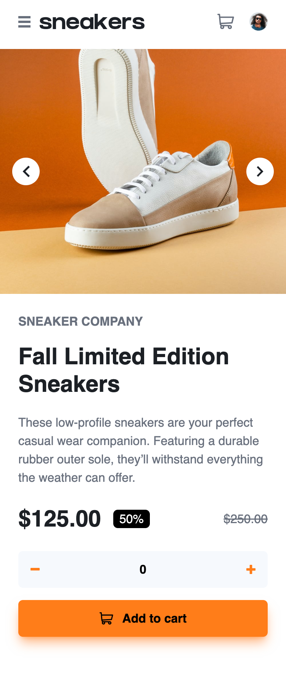

# Frontend Mentor - E-commerce product page solution

This is a solution to the [E-commerce product page challenge on Frontend Mentor](https://www.frontendmentor.io/challenges/ecommerce-product-page-UPsZ9MJp6). Frontend Mentor challenges help you improve your coding skills by building realistic projects.

## Table of contents

-   [Overview](#overview)
    -   [The challenge](#the-challenge)
    -   [Screenshot](#screenshot)
    -   [Links](#links)
-   [My process](#my-process)
    -   [Built with](#built-with)
    -   [What I learned](#what-i-learned)
    -   [Continued development](#continued-development)
    -   [Useful resources](#useful-resources)

### The challenge

Users should be able to:

-   View the optimal layout for the site depending on their device's screen size
-   See hover states for all interactive elements on the page
-   Open a lightbox gallery by clicking on the large product image
-   Switch the large product image by clicking on the small thumbnail images
-   Add items to the cart
-   View the cart and remove items from it

### Screenshot




### Links

-   Solution URL: [Add solution URL here](https://your-solution-url.com)
-   Live Site URL: [Add live site URL here](https://your-live-site-url.com)

## My process

### Built with

-   Semantic HTML5 markup
-   CSS custom properties
-   Flexbox
-   CSS Grid
-   Mobile-first workflow
-   [React](https://reactjs.org/) - JS library
-   TailwindCSS

### What I learned

This time, I switched from Vanilla JavaScript to React. It was challenging to pass data between components while maintaining a single source of truth.
Additionally, changing the color of the given SVG images was quite difficult. However, I found a great resource that I can now use whenever I need to make such style changes.

```html
{/* Close Button */}
<button
...
>
  <div
    className="w-5 h-5 bg-white transition-all duration-300 hover:bg-orange"
    style={{
      WebkitMaskImage: "url(/images/icon-close.svg)",
      WebkitMaskRepeat: "no-repeat",
      WebkitMaskSize: "contain",
      maskImage: "url(/images/icon-close.svg)",
      maskRepeat: "no-repeat",
      maskSize: "contain",
    }}
  ></div>
</button>
```

### Continued development

I'll continue coding using libraries such as React, TailwindCSS, Next.js, and TypeScript for large-scale and dynamic projects."

### Useful resources

-   [Reddit](https://www.reddit.com/r/tailwindcss/comments/1ihjqef/padding_classes_not_working_in_tailwind_v4_in_my/?rdt=59123) – This helped me set up TailwindCSS and layers.
-   [CSS Masks](https://webkit.org/blog/181/css-masks/?utm_source=chatgpt.com) - This resource helped me write the code for changing SVG colors.
# ecommerce-product-page-main
